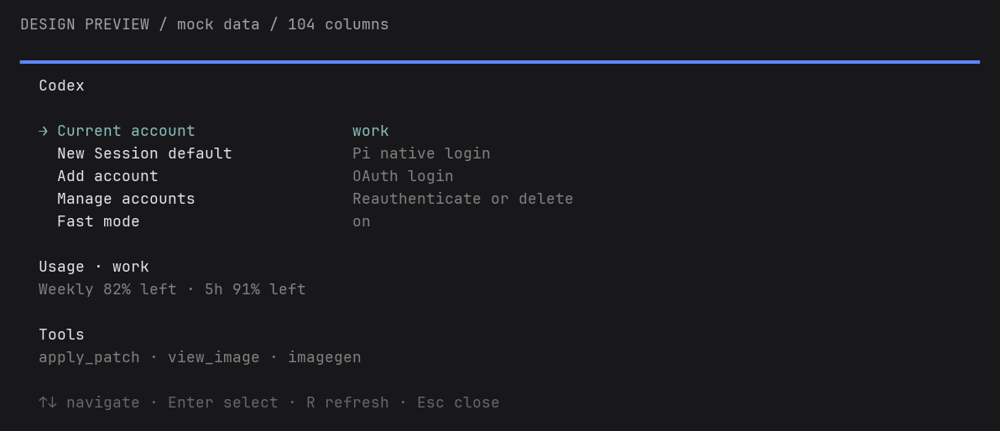
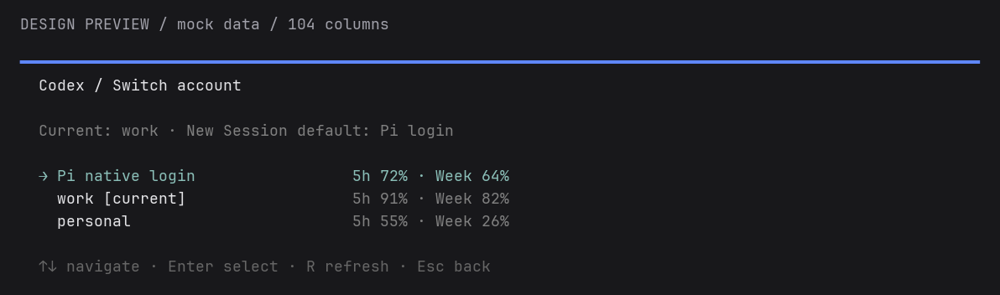
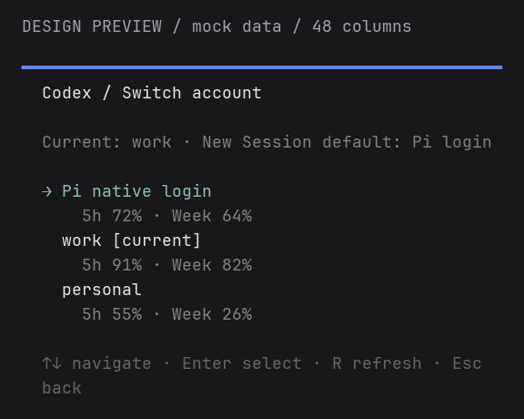
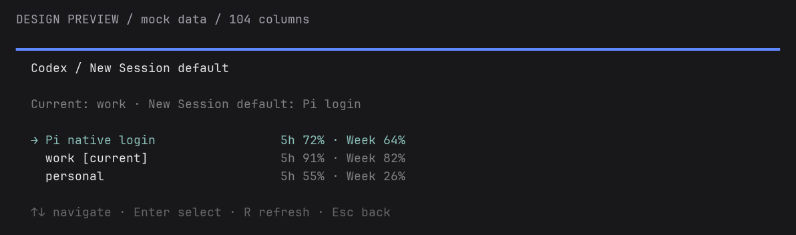
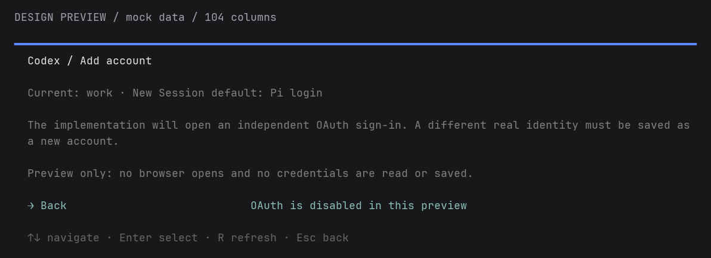
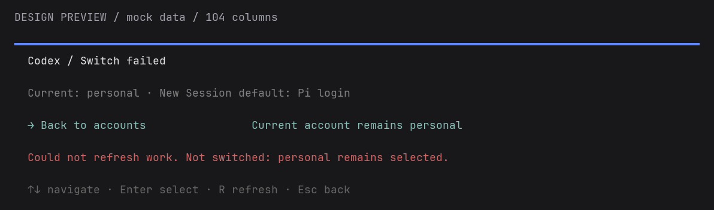
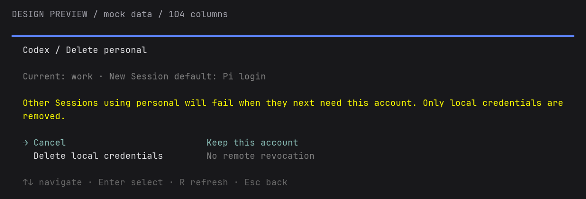
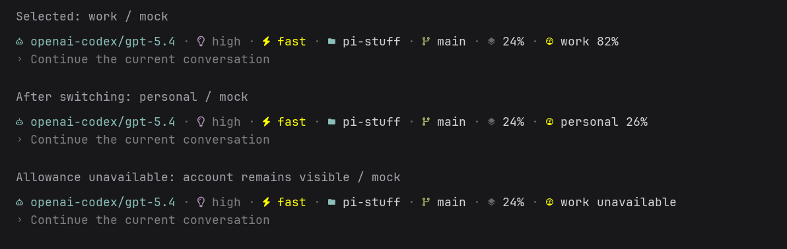

<!-- translation-source: docs/reports/codex-account-selection-preview.md; translation-source-sha256: 00236caf226307280aca508ed57b52b8ba7fd7836140265782f33ac1973a0d4d -->

# Codex 账户选择 TUI 预览

捕获日期：2026-09-07。

本预览展示 [ADR 0035](../adr/0035-own-codex-account-selection.md) 和 Beads `ps-4o1` 中已接受的设计，
不是已实现的账户管理器。所有账户、百分比、切换、默认值、删除和失败都只在内存中模拟。OAuth 页面
仅作说明，不打开浏览器，也不读取或保存凭据。

## 如何阅读预览

临时 Extension 通过现有全宽 Command Dialog coordinator 和原生 SelectList，在真实 Pi 0.85.1 Host 中
挂载模拟视图。Footer 复用 Suite Statusline renderer；由于生产 snapshot 尚无账户名称字段，只在预览中
替换对应显示文字。没有修改生产 TypeScript。临时 fixture 不是 Package resource 或受支持命令。

预览使用空的隔离 agent 目录和 home，不继承凭据或父级 selector，开启 offline 模式，并使用启用 CSI-u
extended keys 的隔离 tmux socket。顶部明确标记模拟，并区分预览控制和产品控制。方向键与 Enter 操作
菜单，Escape 返回一层。仅用于预览的 F/U/0 分别模拟切换失败、额度不可用和重置；关闭视图后可用 F12 重开。

保留的 ANSI 帧来自真实 Host，仅裁去右侧填充空格和末尾空行。以下 PNG 使用 Rich、Pillow 和 JetBrains Mono Nerd Font Mono 将 ANSI
栅格化，并非原生 GUI 截图或视觉验收证据。没有安装新依赖。宽画面为 104 列 × 34 行，窄画面为 48 列 ×
22 行；对话框图片裁去无关的空白区域；Statusline 示例裁自捕获帧。保留的证据不包含私有路径或类似凭据的值。

## 主控制界面

当前账户和新 Session 默认值各占一个独立选项，账户操作与 Fast mode、额度和 Tools 放在一起。

## 账户选择器

选择账户只影响当前 Session。可用的五小时和每周额度帮助决定使用哪个账户；查看额度不会改变选择。
Pi 原生登录仍可选择。

同一选择器在窄终端中的样子：

## 启动默认值与登录

修改新 Session 默认值是单独的操作；现有 Session、fork 和运行中的子 Agent 不会跟随变化。

登录预览只说明独立 OAuth 步骤，不实现认证。

## 失败与删除

切换失败的画面保持 personal 被选中，并明确显示仍生效的账户。生产功能必须验证该身份后才能这样报告；
这里仅模拟这一结果。

删除默认选中 Cancel，并警告其他引用 Session 会受影响。必须先移除当前账户和启动默认引用，不撤销远端授权。

## 常驻状态

现有 Codex 组先显示账户，再显示本周剩余额度。切换时两者一起更新；额度缺失时仍保留账户名。这些是
模拟 Footer 的裁剪图，不是新增的 Statusline 行。

## 证据限制

本地检查通过了 13 个宽窄视图捕获点，覆盖键盘导航、模拟切换、默认值选择器、删除确认、失败展示、额度不可用、Escape 恢复和窄终端渲染。
它不证明 OAuth、刷新锁、私有适配器兼容性、真实 Session 隔离、子 Agent 继承、持久化、实际额度或跨账户
Codex 续接。这些仍是 spec 中的功能验收要求。浅色主题和认证验收也尚未完成，不能凭预览关闭 `ps-4o1`。
